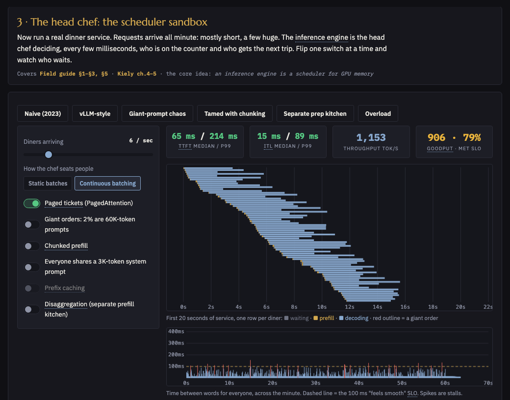

# Inference Kitchen

**A hands-on lab for how AI models actually get served.** Drag sliders, flip switches, and break a GPU kitchen on purpose: memory, batching, the scheduler, splitting big models, and the economics of running your own GPUs.

Every chatbot reply is cooked in a GPU kitchen. The **GPU** is the kitchen, its memory (**HBM**) is the counter, the model's **weights** are the recipe books that must stay on the counter, each user's **KV cache** is their order ticket, and the **inference engine** is the head chef deciding who gets cooked for next. Hold that picture and the rest follows.

## What's inside

| Step | You play with | What clicks |
|---|---|---|
| **0 · Hit Enter** | One request, animated: prefill reads the prompt in one pass, decode writes one token per trip | Speed ≈ bandwidth ÷ model size; why output tokens cost more |
| **1 · The counter** | GPU, model, precision, context length, number of users; watch memory overflow | Memory decides the hardware; context multiplies cost; **MoE saves compute, not memory** |
| **2 · The batch dial** | Batch size vs one user's speed and the fleet's total; speculative decoding | Why batching made tokens cheap; where decode turns compute-bound |
| **3 · The head chef** | A live scheduler sandbox: continuous batching, paged KV, chunked prefill, prefix caching, disaggregation | *An inference engine is a scheduler for GPU memory.* Goodput vs throughput |
| **4 · Big kitchens** | Tensor, pipeline and expert parallelism across 8 or 16 GPUs; MoE expert coverage | Why TP stays inside a machine; why big MoE needs expert parallelism |
| **5 · The business** | Fleet break-even by traffic shape and pooling; a GPU failure clock; the cold-start stack; who sells what | Self-hosting is a **utilization bet**, not a price bet |
| **★ Capstone** | Three client briefs (code assistant, support bot, voice agent), scored on fit, SLO and budget | You can make the calls |
| **✓ Field test** | Eight questions you answer by operating the widgets | Proof it stuck |

Each step has predict-then-reveal questions and a "say it out loud" line that unlocks once you've played. Every term has a tooltip with its plain meaning and its kitchen equivalent.

## Run it

Open `index.html` in a browser. There's no build step, no dependencies, and nothing to install.

## What's exact and what's a model

- **Exact:** the memory arithmetic (weights, KV cache per token, users that fit), MoE expert coverage `1 − (1 − k/E)^tokens`, the speculative-decoding formula (Leviathan et al., 2023), and the break-even math.
- **Teaching models:**
  - Decode speed assumes 70% of peak bandwidth and compute.
  - The scheduler sandbox uses round-number costs.
  - The parallelism panel approximates communication with ring all-reduce and all-to-all volumes.
- **The directions are real; the milliseconds are not a benchmark.**

GPU specs (A100, H100, H200, B200) come from the audited [Hyperscale Ledger](https://github.com/bakulbadwal/hyperscale-ledger). GB means 10⁹ bytes throughout. [`ACCEPTANCE.md`](ACCEPTANCE.md) lists every number the build was checked against.

## Sources

- Philip Kiely, *Inference Engineering* (Baseten Books, 2026): the spine
- *How to Scale Your Model* (Google DeepMind, 2025): roofline and sharding cross-checks
- Leviathan, Kalman & Matias, "Fast Inference from Transformers via Speculative Decoding" (2023)
- Kwon et al., "Efficient Memory Management for LLM Serving with PagedAttention" (2023)
- Meta, *The Llama 3 Herd of Models* (2024): the GPU failure rate

## Files

| File | Role |
|---|---|
| `index.html` | All teaching copy and page structure |
| `js/core.js` | The math: pure functions, exposed as `window.IK` |
| `js/sim.js` | The scheduler simulation: deterministic, seeded |
| `js/app.js` | Wires controls to the math and draws the charts |
| `js/gpus.js` | GPU specs generated from the Hyperscale Ledger |
| `js/glossary.js` | Tooltip definitions |

Built by [Bakul Badwal](https://github.com/bakulbadwal) (UVA Darden MBA '27) with Claude Code, as an interactive companion to a field guide on the a16z Academy's *AI Inference Engineering* course.

## License

MIT
